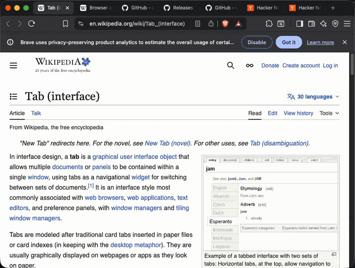
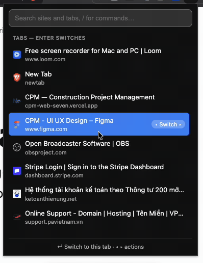

# No More Tabs

A Chrome/Brave extension that tames tab overload: a keyboard-first
command palette to close tabs by site, switch tabs, dedupe, and organize
everything into tab groups.

## Demo

*([mp4 version](demo.mp4) for full quality.)*

## Features

### Command palette

One search box, one list, no buttons. Press `Cmd+Shift+X` (Mac) /
`Ctrl+Shift+X` (Windows/Linux) or click the toolbar icon. Three sections,
all with site favicons and filtered live as you type:

| Section | Shows | Actions (`←` `→` to choose, `Enter` to run) |
|---|---|---|
| **Sites** | favicon + `hostname (count)` | Close all · Group tabs · Keep latest |
| **Tabs** | all tabs, most recently used first | Switch · Close tab |
| **Commands** | global operations | run |

- The status bar always previews exactly what `Enter` will do.
- `↑` `↓` navigate; `←` `→` cycle the selected row's action (when the
  caret is at the edge of the search text); `Esc` closes.
- `Cmd+Shift+Space` / `Ctrl+Shift+Space` opens the same palette with the
  **Tabs** section first, for quick switching.

### Slash commands

*([mp4 version](demo-slash.mp4) for full quality.)*

Type `/` to list only commands, matched by alias:

| Command | What it does |
|---|---|
| `/dedupe` | Close duplicated tabs (same exact URL, keeps the latest) |
| `/single` | Keep a single (latest) tab per site, close the rest |
| `/group` | Group all tabs into Chrome tab groups, one per site |
| `/ungroup` | Remove every tab group |
| `/merge` | Move all tabs from every window into the current window |
| `/domain` | Toggle grouping sites by main domain vs hostname (`mail.google.com` + `docs.google.com` → `google.com`) |
| `/prefs` | Open Preferences |

### Right-click menu

Right-click any page or the toolbar icon → **No More Tabs**: close all by
hostname or by main domain (submenus with live `site (count)` entries),
close duplicated, keep single tab per hostname, group all tabs by
hostname, ungroup all, and merge all windows.

### Always switch to existing tab

In **Preferences** keep an editable list of sites. When a tab navigates
into a listed site and a tab for it is already open, the existing tab is
focused (and pointed at the requested URL) and the duplicate closes.
Entries cover their subdomains; the list syncs via `chrome.storage.sync`.

### Safety rules

- Pinned tabs are never closed, grouped, or unpinned.
- "Latest" means the most recently used tab; the active tab always wins.

## Install

### From a release

1. Download the zip from the [latest release](https://github.com/layatai/nomoretabs/releases/latest)
   and unzip it.
2. Open `chrome://extensions` (or `brave://extensions`).
3. Enable **Developer mode** (top right).
4. Click **Load unpacked** and select the unzipped folder.

### From source

Clone this repo and load the folder the same way (steps 2–4 above).

Customize the hotkeys at `chrome://extensions/shortcuts`.

## Development

No build step — plain Manifest V3, vanilla JS.

| File | Role |
|---|---|
| `manifest.json` | MV3 config, permissions, hotkeys |
| `background.js` | service worker: context menus, enforced switch-to-tab, hotkey routing |
| `tabops.js` | shared tab grouping/closing/merging logic |
| `popup.html/js/css` | the command palette |
| `options.html/js/css` | Preferences page |
| `scripts/build.sh` | packages `dist/nomoretabs-<version>.zip` |

Releases are automated: pushing a `v*` tag matching the `manifest.json`
version builds the zip and publishes a GitHub release
(`.github/workflows/release.yml`); every push to `main` builds an
artifact (`build.yml`).
